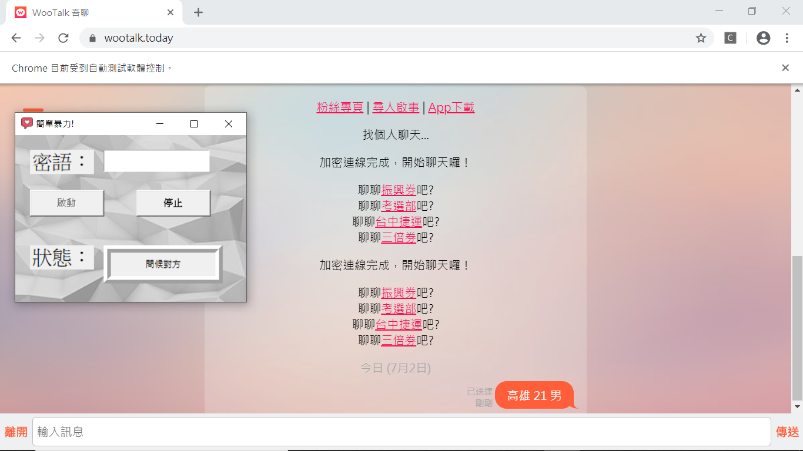

### wootalk篩選機器人

使用python以Selenium函式庫開發的自動化爬蟲程式，可以自動化操作wootalk網頁並篩選特定性別的人。

> 使用時必須下載chromedriver.exe

| 檔案名稱 | 說明 |
| ---- | ---- |
| webspider.py | 用於爬取wootalk頁面的爬蟲 |
| filter.py | 負責篩選的自動化程式 |
| main.py | 程式gui介面 |

* [專案報告](https://github.com/TH04e22/Wootalk_man_filter/blob/master/LCS_Team12_final_report.docx)
* [專案簡報](https://github.com/TH04e22/Wootalk_man_filter/blob/master/LCS_Team12.pptx)
